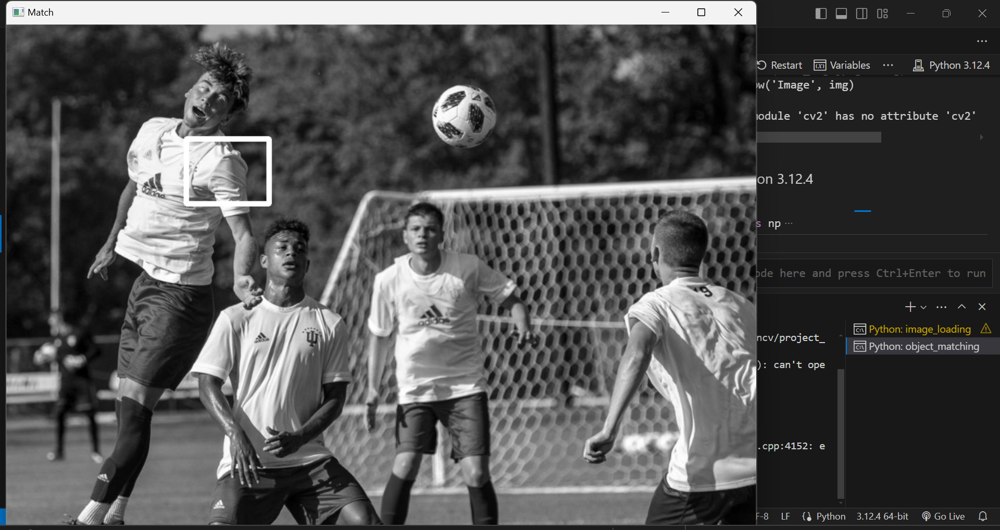

# OpenCV Projects Repository

This repository contains a collection of OpenCV projects demonstrating various image processing and computer vision techniques. Each script showcases different functionalities of OpenCV, from basic image loading to advanced feature detection.

## Repository Structure

### Files

1. **image_loading.py**
2. **image_manipulation.py**
3. **video_capture.py**
4. **drawing.py**
5. **colour_detection.py**
6. **corner_detection.py**
7. **object_matching.py**
8. **face_eye_detection.py**

### Images

1. **ball.PNG**
2. **chessboard.png**
3. **logo.jpg**
4. **shoe.PNG**
5. **soccer_practice.jpg**

### Captured Results

1. **image_manipulation_capture.png**
2. **object_matching_capture.png**
3. **corner_capture.png**
4. **colour_capture2.png**
5. **colour_capture.png**
6. **face_eye_capture.png**

## Descriptions and Captured Results

### 1. image_loading.py
This script demonstrates how to load, resize, rotate, and save an image using OpenCV.

- **Operations**: 
  - Load an image (`logo.jpg`)
  - Resize the image to half its original size
  - Rotate the image 90 degrees clockwise
  - Save the modified image as `new_img.jpg`

### 2. image_manipulation.py
This script includes operations such as changing pixel values to random colors and copying part of an image to another location within the same image.

- **Operations**:
  - Change the first 100 rows of the image to random colors
  - Copy a section of the image and paste it in a different location


### 3. video_capture.py
This script captures video from the webcam, resizes the frames, and arranges them in a 2x2 grid with some frames rotated.

- **Operations**:
  - Capture video from the webcam
  - Resize the video frames
  - Arrange frames in a 2x2 grid with rotations

### 4. drawing.py
This script demonstrates how to draw basic shapes (lines, rectangles, circles) and text on an image captured from the webcam.

- **Operations**:
  - Draw lines, rectangles, and circles
  - Add text to the image

### 5. colour_detection.py
This script converts a frame captured from the webcam to HSV color space and detects a specified color range, showing the mask and the resulting image.

- **Operations**:
  - Convert image to HSV color space
  - Detect a specific color range (blue in this case)
  - Display the mask and result


### 6. corner_detection.py
This script detects corners in a resized chessboard image using the `cv2.goodFeaturesToTrack` function and draws lines connecting the corners.

- **Operations**:
  - Detect corners in the `chessboard.png` image
  - Draw circles at detected corners
  - Draw lines connecting the corners


### 7. object_matching.py
This script matches a template image (shoe.PNG) within a larger image (soccer_practice.jpg) using different template matching methods.

- **Operations**:
  - Load the main image and template image
  - Use various template matching methods to find the template in the main image
  - Draw rectangles around the detected template



### 8. face_eye_detection.py
This script detects faces and eyes in a video stream from the webcam using Haar cascades.

- **Operations**:
  - Detect faces in the video stream
  - Detect eyes within the detected faces
  - Draw rectangles around detected faces and eyes


## How to Run

1. Ensure you have OpenCV installed:
    ```sh
    pip install opencv-python
    ```

2. Clone the repository:
    ```sh
    git clone <repository_url>
    cd <repository_name>
    ```

3. Place the required images in the `assets` directory.

4. Run the desired script:
    ```sh
    python <script_name>.py
    ```

5. Results will be displayed on the screen and can be saved as needed.

## Notes

- The face and video captures are of the repository owner, taken through the webcam.
- Adjust the file paths and other parameters as necessary for your environment.

## License

This project is licensed under the MIT License.

## Author

- **Your Name**

Feel free to reach out for any questions or contributions!
